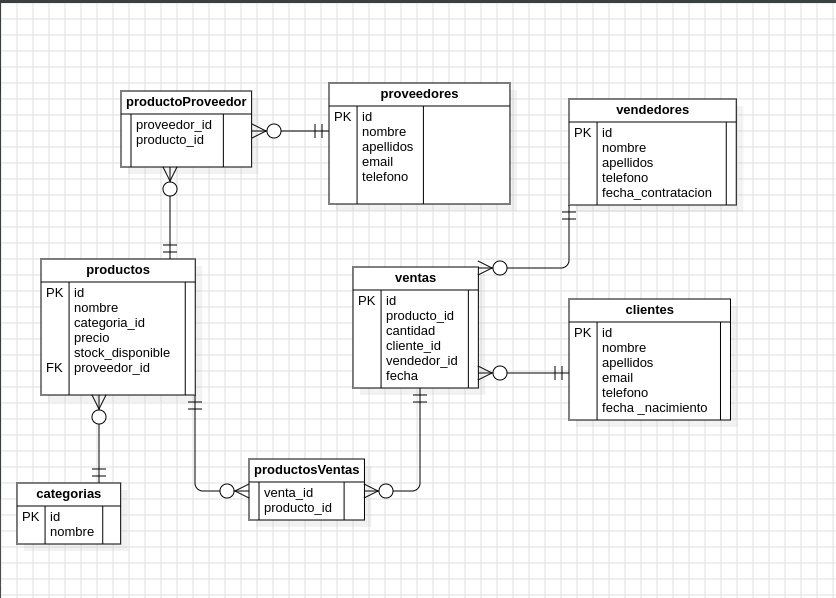

# Proyecto de Gestión de Ventas

## Descripción del Proyecto

La tienda TechZone es un negocio dedicado a la venta de productos tecnológicos, desde laptops y
teléfonos hasta accesorios y componentes electrónicos. Con el crecimiento del comercio digital y
la alta demanda de dispositivos electrónicos, la empresa ha notado la necesidad de mejorar la
gestión de su inventario y ventas
El sistema está diseñado utilizando **PostgreSQL** como base de datos relacional y se incluye un conjunto de scripts SQL que permiten crear las tablas necesarias, insertar datos de ejemplo y ejecutar consultas, así como procedimientos almacenados para registrar ventas de manera eficiente.

### Propósito

El propósito principal de este proyecto es proporcionar una estructura básica para gestionar productos, clientes, ventas y consultas complejas de forma sencilla en una base de datos PostgreSQL.

### Funcionalidad

- **Gestión de Productos**: Registro de productos y su stock disponible.
- **Gestión de Clientes**: Registro de clientes con sus datos personales.
- **Gestión de Ventas**: Registro de ventas, asociando productos, clientes y vendedores.
- **Consultas y Reportes**: Realización de consultas para obtener información sobre ventas, clientes y productos más vendidos.
- **Procedimientos Almacenados**: Proceso automatizado para registrar ventas, validando que haya suficiente stock antes de procesar la venta.

---

## Modelo Entidad-Relación (E-R)



---

## Instrucciones para Importar y Ejecutar los Archivos SQL en PostgreSQL

1. **Instalar PostgreSQL**: Si no tienes PostgreSQL instalado, puedes obtenerlo desde su [sitio web oficial](https://www.postgresql.org/download/).
2. **Crear la Base de Datos**:
   - Abre una terminal y accede a PostgreSQL:
     ```bash
     psql -U postgres
     ```
   - Crea una base de datos:
     ```sql
     CREATE DATABASE ventas_db;
     ```
3. **Importar los Archivos SQL**:
   - Una vez en PostgreSQL, selecciona la base de datos:
     ```sql
     \c ventas_db
     ```
   - Importa los archivos SQL en el siguiente orden:
     1. **Crear tablas y relaciones**: Ejecuta el archivo `db.sql`.
     2. **Insertar datos de ejemplo**: Ejecuta el archivo `insert.sql`.
     3. **Ejecutar consultas de ejemplo**: Ejecuta el archivo `queries.sql`.
     4. **Crear procedimiento almacenado**: Ejecuta el archivo `procedure.sql`.

   Puedes ejecutar cada archivo utilizando el comando `\i` en psql:
   ```bash
   \i /ruta/a/db.sql
   \i /ruta/a/insert.sql
   \i /ruta/a/queries.sql
   \i /ruta/a/ProcedureAndFunctions.sql
